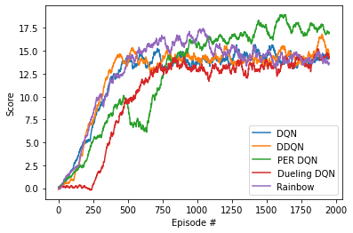
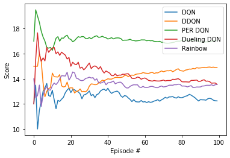

# Project details

The development of this project was an amazing way to learn about deep reinforcement learning and it's optimization techniques. I will explain the architecture in a bit depth, what i've learnt from that and my conclusions.

Several agents with different algorithms were implemented. I used the same network architecture for them all (except for Dueling DQN agent, which has his own model implementation):

- 5 fully connected layers
- 37 neurons as input
- 256 neurons in the intermediate layers
- 4 neurons as output
- All layers are processed by a ReLU function

Now, I will explain all the architectures:


### Vanilla DQN

First of all, I implemented a vanilla version of the DQN algorithm, as we saw in the past course's lessons.

This algorithm implements Replay buffer, which stores experiences as the environment is playing. Also is implemented a target network, used to get better main network updates, as this network won't get updated so frecuently so we can retrieve the expected values from that. After some episodes, it will take the collected experiences and begin the process of learning. This process will compare the results of the actions taken in the states of the experiences and the results expected, calculated by the DQN formula. Then, we will use the difference between them (loss) to update the neural network. The process is the next:

```
states, actions, rewards, next_states, dones = experiences

# Retrieve the values corresponding to the states and actions of the experiences from Q table
state_action_values = self.qnetwork_local(states).gather(1, actions)

# Retrieve the maximum values of future states in the batch of experiences from target table
next_state_values = self.qnetwork_target(next_states).max(1)[0].detach().unsqueeze(1)

# Calculate the expected state action values with DQN formula
expected_state_action_values = (next_state_values * GAMMA * (1 - dones)) + rewards

# Calculate the loss
criterion = nn.SmoothL1Loss()
loss = criterion(state_action_values, expected_state_action_values)

# Optimize the model
self.optimizer.zero_grad()
loss.backward()
self.optimizer.step()
```

For this agent, I used the followed hyperparameters:
- Replay buffer size: 1e5
- Minibatch size: 64
- Discount factor (gamma): 0.99 
- Soft update of target parameters (TAU): 1e-3
- Learning rate: 5e-4
- Target update frequency: 4
- Number of episodes: 2000
- Steps for each episode: 1000
- Epsilon start: 1
- Epsilon end: 0.01
- Epsilon decay: 0.995

This results in one of the fastest agent to achieve a score of 13, in a bit more than 500 episodes:

```
Starting training with a vanilla DQN agent:
Episode 100	Average Score: 0.45
Episode 200	Average Score: 3.00
Episode 300	Average Score: 6.04
Episode 400	Average Score: 9.60
Episode 500	Average Score: 12.80
Episode 600	Average Score: 13.69
Episode 700	Average Score: 14.01
Episode 800	Average Score: 13.97
Episode 900	Average Score: 13.95
Episode 1000	Average Score: 13.79
Episode 1100	Average Score: 13.97
Episode 1200	Average Score: 13.96
Episode 1300	Average Score: 13.99
Episode 1400	Average Score: 14.82
Episode 1500	Average Score: 14.61
Episode 1600	Average Score: 14.68
Episode 1700	Average Score: 14.15
Episode 1800	Average Score: 13.69
Episode 1900	Average Score: 13.89
Episode 2000	Average Score: 14.40
Environment solved in 544 episodes!
```

However, it can't make it; the algorithm can't reach a score of 13 over 100 episodes on testing:

```
Starting the inference of the DQN agent algorithm!
Episode: 1, Score: 12.0
Episode: 2, Score: 13.5
Episode: 3, Score: 10.0
Episode: 4, Score: 11.5
Episode: 5, Score: 12.2
Episode: 6, Score: 13.0
Episode: 7, Score: 13.285714285714286
Episode: 8, Score: 13.625
Episode: 9, Score: 12.666666666666666
Episode: 10, Score: 12.6
Episode: 11, Score: 13.090909090909092
Episode: 12, Score: 12.333333333333334
Episode: 13, Score: 11.615384615384615
Episode: 14, Score: 12.285714285714286
Episode: 15, Score: 12.2
Episode: 16, Score: 12.375
Episode: 17, Score: 12.529411764705882
Episode: 18, Score: 12.88888888888889
Episode: 19, Score: 13.105263157894736
Episode: 20, Score: 13.25
Episode: 21, Score: 12.904761904761905
Episode: 22, Score: 13.136363636363637
Episode: 23, Score: 13.130434782608695
Episode: 24, Score: 13.0
Episode: 25, Score: 12.96
Episode: 26, Score: 12.807692307692308
Episode: 27, Score: 12.407407407407407
Episode: 28, Score: 12.714285714285714
Episode: 29, Score: 12.758620689655173
Episode: 30, Score: 12.866666666666667
Episode: 31, Score: 13.03225806451613
Episode: 32, Score: 12.65625
Episode: 33, Score: 12.757575757575758
Episode: 34, Score: 12.5
Episode: 35, Score: 12.742857142857142
Episode: 36, Score: 12.805555555555555
Episode: 37, Score: 13.027027027027026
Episode: 38, Score: 13.131578947368421
Episode: 39, Score: 13.179487179487179
Episode: 40, Score: 13.05
Episode: 41, Score: 13.24390243902439
Episode: 42, Score: 13.0
Episode: 43, Score: 12.837209302325581
Episode: 44, Score: 12.931818181818182
Episode: 45, Score: 12.977777777777778
Episode: 46, Score: 13.021739130434783
Episode: 47, Score: 12.914893617021276
Episode: 48, Score: 12.645833333333334
Episode: 49, Score: 12.53061224489796
Episode: 50, Score: 12.66
Episode: 51, Score: 12.627450980392156
Episode: 52, Score: 12.48076923076923
Episode: 53, Score: 12.358490566037736
Episode: 54, Score: 12.185185185185185
Episode: 55, Score: 12.345454545454546
Episode: 56, Score: 12.178571428571429
Episode: 57, Score: 12.157894736842104
Episode: 58, Score: 12.155172413793103
Episode: 59, Score: 12.271186440677965
Episode: 60, Score: 12.15
Episode: 61, Score: 12.180327868852459
Episode: 62, Score: 12.112903225806452
Episode: 63, Score: 12.174603174603174
Episode: 64, Score: 12.125
Episode: 65, Score: 12.153846153846153
Episode: 66, Score: 12.227272727272727
Episode: 67, Score: 12.26865671641791
Episode: 68, Score: 12.338235294117647
Episode: 69, Score: 12.217391304347826
Episode: 70, Score: 12.32857142857143
Episode: 71, Score: 12.408450704225352
Episode: 72, Score: 12.527777777777779
Episode: 73, Score: 12.452054794520548
Episode: 74, Score: 12.554054054054054
Episode: 75, Score: 12.56
Episode: 76, Score: 12.578947368421053
Episode: 77, Score: 12.506493506493506
Episode: 78, Score: 12.461538461538462
Episode: 79, Score: 12.569620253164556
Episode: 80, Score: 12.5
Episode: 81, Score: 12.493827160493828
Episode: 82, Score: 12.548780487804878
Episode: 83, Score: 12.614457831325302
Episode: 84, Score: 12.654761904761905
Episode: 85, Score: 12.764705882352942
Episode: 86, Score: 12.69767441860465
Episode: 87, Score: 12.597701149425287
Episode: 88, Score: 12.5
Episode: 89, Score: 12.359550561797754
Episode: 90, Score: 12.233333333333333
Episode: 91, Score: 12.340659340659341
Episode: 92, Score: 12.326086956521738
Episode: 93, Score: 12.32258064516129
Episode: 94, Score: 12.297872340425531
Episode: 95, Score: 12.410526315789474
Episode: 96, Score: 12.447916666666666
Episode: 97, Score: 12.402061855670103
Episode: 98, Score: 12.295918367346939
Episode: 99, Score: 12.252525252525253
Episode: 100, Score: 12.24
Score: 12.24
```

The reason: it's bad at generalizing. It could get a high score in some episodes, but it got stuck so many times, lowering the mean drastically. Let's see its brothers.


### Double DQN

This algorithm is an extension of the vanilla DQN, with a small modification: we now test our actions against the target network. So, the learn process will change a bit:

```
states, actions, rewards, next_states, dones = experiences

# Retrieve the values corresponding to the states and actions of the experiences from Q table
state_action_values = self.qnetwork_local(states).gather(1, actions)

################################# Double DQN #################################
# Retrieve the maximum value indexes from Q table for next states
next_max_actions_local = self.qnetwork_local(next_states).detach().argmax(1).unsqueeze(1)

# Retrieve the maximum values of future states in the batch of experiences from target table
next_state_values = self.qnetwork_target(next_states).gather(1, next_max_actions_local).detach()
##############################################################################

# Calculate the expected state action values with DQN formula
expected_state_action_values = (next_state_values * GAMMA * (1 - dones)) + rewards

# Calculate the loss
criterion = nn.SmoothL1Loss()
loss = criterion(state_action_values, expected_state_action_values)

# Optimize the model
self.optimizer.zero_grad()
loss.backward()
self.optimizer.step()
```

For this agent, I used the followed hyperparameters:
- Replay buffer size: 1e5
- Minibatch size: 64
- Discount factor (gamma): 0.99 
- Soft update of target parameters (TAU): 1e-3
- Learning rate: 5e-4
- Target update frequency: 4
- Number of episodes: 2000
- Steps for each episode: 1000
- Epsilon start: 1
- Epsilon end: 0.01
- Epsilon decay: 0.995

In the process of learning, we won't see a better speed on reach a score of 13, lasting a bit more than 500 episodes (like vanilla)

```
Starting training with a Double DQN agent: 
Episode 100	Average Score: 0.23
Episode 200	Average Score: 1.88
Episode 300	Average Score: 6.70
Episode 400	Average Score: 10.97
Episode 500	Average Score: 14.07
Episode 600	Average Score: 14.21
Episode 700	Average Score: 13.71
Episode 800	Average Score: 13.52
Episode 900	Average Score: 14.38
Episode 1000	Average Score: 14.36
Episode 1100	Average Score: 14.09
Episode 1200	Average Score: 14.08
Episode 1300	Average Score: 14.51
Episode 1400	Average Score: 13.67
Episode 1500	Average Score: 14.13
Episode 1600	Average Score: 13.95
Episode 1700	Average Score: 14.79
Episode 1800	Average Score: 13.95
Episode 1900	Average Score: 14.60
Episode 2000	Average Score: 15.66
```

Let's see how it performs on testing:

```
Starting the inference of the Double DQN agent algorithm!
Episode: 1, Score: 15.0
Episode: 2, Score: 15.0
Episode: 3, Score: 15.0
Episode: 4, Score: 16.0
Episode: 5, Score: 15.4
Episode: 6, Score: 13.666666666666666
Episode: 7, Score: 12.571428571428571
Episode: 8, Score: 13.0
Episode: 9, Score: 13.222222222222221
Episode: 10, Score: 13.3
Episode: 11, Score: 14.454545454545455
Episode: 12, Score: 14.166666666666666
Episode: 13, Score: 14.153846153846153
Episode: 14, Score: 14.142857142857142
Episode: 15, Score: 14.333333333333334
Episode: 16, Score: 13.4375
Episode: 17, Score: 13.352941176470589
Episode: 18, Score: 13.38888888888889
Episode: 19, Score: 13.736842105263158
Episode: 20, Score: 13.25
Episode: 21, Score: 13.285714285714286
Episode: 22, Score: 13.272727272727273
Episode: 23, Score: 12.869565217391305
Episode: 24, Score: 13.0
Episode: 25, Score: 13.04
Episode: 26, Score: 13.192307692307692
Episode: 27, Score: 12.962962962962964
Episode: 28, Score: 13.0
Episode: 29, Score: 12.96551724137931
Episode: 30, Score: 13.1
Episode: 31, Score: 13.419354838709678
Episode: 32, Score: 13.59375
Episode: 33, Score: 13.575757575757576
Episode: 34, Score: 13.529411764705882
Episode: 35, Score: 13.542857142857143
Episode: 36, Score: 13.666666666666666
Episode: 37, Score: 13.756756756756756
Episode: 38, Score: 13.894736842105264
Episode: 39, Score: 13.846153846153847
Episode: 40, Score: 13.925
Episode: 41, Score: 14.0
Episode: 42, Score: 13.976190476190476
Episode: 43, Score: 13.976744186046512
Episode: 44, Score: 14.045454545454545
Episode: 45, Score: 14.11111111111111
Episode: 46, Score: 14.108695652173912
Episode: 47, Score: 14.106382978723405
Episode: 48, Score: 14.104166666666666
Episode: 49, Score: 14.142857142857142
Episode: 50, Score: 14.26
Episode: 51, Score: 14.27450980392157
Episode: 52, Score: 14.173076923076923
Episode: 53, Score: 14.264150943396226
Episode: 54, Score: 14.296296296296296
Episode: 55, Score: 14.272727272727273
Episode: 56, Score: 14.357142857142858
Episode: 57, Score: 14.385964912280702
Episode: 58, Score: 14.39655172413793
Episode: 59, Score: 14.423728813559322
Episode: 60, Score: 14.5
Episode: 61, Score: 14.459016393442623
Episode: 62, Score: 14.435483870967742
Episode: 63, Score: 14.428571428571429
Episode: 64, Score: 14.484375
Episode: 65, Score: 14.523076923076923
Episode: 66, Score: 14.424242424242424
Episode: 67, Score: 14.477611940298507
Episode: 68, Score: 14.470588235294118
Episode: 69, Score: 14.55072463768116
Episode: 70, Score: 14.628571428571428
Episode: 71, Score: 14.56338028169014
Episode: 72, Score: 14.61111111111111
Episode: 73, Score: 14.643835616438356
Episode: 74, Score: 14.635135135135135
Episode: 75, Score: 14.68
Episode: 76, Score: 14.56578947368421
Episode: 77, Score: 14.636363636363637
Episode: 78, Score: 14.743589743589743
Episode: 79, Score: 14.79746835443038
Episode: 80, Score: 14.6625
Episode: 81, Score: 14.62962962962963
Episode: 82, Score: 14.609756097560975
Episode: 83, Score: 14.698795180722891
Episode: 84, Score: 14.726190476190476
Episode: 85, Score: 14.776470588235295
Episode: 86, Score: 14.767441860465116
Episode: 87, Score: 14.827586206896552
Episode: 88, Score: 14.795454545454545
Episode: 89, Score: 14.887640449438202
Episode: 90, Score: 14.855555555555556
Episode: 91, Score: 14.868131868131869
Episode: 92, Score: 14.891304347826088
Episode: 93, Score: 14.913978494623656
Episode: 94, Score: 14.882978723404255
Episode: 95, Score: 14.926315789473684
Episode: 96, Score: 14.9375
Episode: 97, Score: 14.907216494845361
Episode: 98, Score: 14.928571428571429
Episode: 99, Score: 14.8989898989899
Episode: 100, Score: 14.9
Score: 14.9
```

It reached the goal! A good mean of 14.9. It get stuck sometimes, but clearly avoided the stuck situations way better than the vanilla one.


### Prioritized experience replay

This algorithm extends the vanilla one, but this time experiences will be weighted in the buffer replay. If we prioritize the experiences with higher error and use them to learn, our agent will be able to learn better. This algorithm is slower than the previous ones, but is able to generalize better in less episodes. The main change in this algorithm is that we maintain an additional memory (with the same size as the main memory), where we store the weights of the experiences. Then, when we are going to sample the experiences, we choose the experiences applying a normal distribution. To give all experiences a chance to be chosen, we add an offset to a priority before we store it. Additionally, we add a parameter (alpha) which will determine how many we use the priorities, being 0 full random and 1 full priorities. I set an alpha of 0.7.

In the learn method of the agent we update de priorities with the calculated loss:
```
...
# Calculate the loss
importance_sampling_weights = torch.Tensor(importance_sampling_weights).to(device)
loss = (importance_sampling_weights * F.mse_loss(state_action_values, expected_state_action_values)).mean()

self.memory.update_priorities(indices, loss + 1e-5)

# Optimize the model
self.optimizer.zero_grad()
loss.backward()
self.optimizer.step()
...
```

Then, when sampling, we will apply a normal distribution to choose priorities:
```
memory_priorities = self.priorities[:len(self.memory)] ** ALPHA
importance_sampling_weights = memory_priorities / sum(memory_priorities)

indexes = np.random.choice(len(self.memory), self.batch_size, p=importance_sampling_weights)
experiences = [self.memory[e] for e in indexes]
```

For this agent, I used the followed hyperparameters:
- Replay buffer size: 1e5
- Minibatch size: 64
- Discount factor (gamma): 0.99 
- Soft update of target parameters (TAU): 1e-3
- Learning rate: 5e-4
- Target update frequency: 4
- Number of episodes: 2000
- Steps for each episode: 1000
- Epsilon start: 1
- Epsilon end: 0.01
- Epsilon decay: 0.995

The process of learning is considerably slower, lasting more than 900 episodes to get a score of 13:
```
Episode 100	Average Score: 0.48
Episode 200	Average Score: 1.92
Episode 300	Average Score: 4.12
Episode 400	Average Score: 6.51
Episode 500	Average Score: 9.12
Episode 600	Average Score: 8.01
Episode 700	Average Score: 7.08
Episode 800	Average Score: 11.08
Episode 900	Average Score: 14.31
Episode 1000	Average Score: 15.34
Episode 1100	Average Score: 15.59
Episode 1200	Average Score: 16.21
Episode 1300	Average Score: 16.42
Episode 1400	Average Score: 16.60
Episode 1500	Average Score: 17.17
Episode 1600	Average Score: 17.08
Episode 1700	Average Score: 18.43
Episode 1800	Average Score: 17.44
Episode 1900	Average Score: 17.36
Episode 2000	Average Score: 17.38
```

Still, we can see the maximum score earned is so high. 18.43! How it will do at testing? Let's see!

```
Starting the inference of the Prioritized Experience Replay agent algorithm!
Episode: 1, Score: 17.0
Episode: 2, Score: 19.5
Episode: 3, Score: 19.0
Episode: 4, Score: 18.5
Episode: 5, Score: 17.8
Episode: 6, Score: 17.333333333333332
Episode: 7, Score: 17.0
Episode: 8, Score: 16.5
Episode: 9, Score: 16.444444444444443
Episode: 10, Score: 16.5
Episode: 11, Score: 16.272727272727273
Episode: 12, Score: 16.75
Episode: 13, Score: 17.23076923076923
Episode: 14, Score: 17.357142857142858
Episode: 15, Score: 17.0
Episode: 16, Score: 17.25
Episode: 17, Score: 17.235294117647058
Episode: 18, Score: 17.38888888888889
Episode: 19, Score: 17.473684210526315
Episode: 20, Score: 17.2
Episode: 21, Score: 17.142857142857142
Episode: 22, Score: 16.954545454545453
Episode: 23, Score: 17.043478260869566
Episode: 24, Score: 17.208333333333332
Episode: 25, Score: 17.36
Episode: 26, Score: 17.307692307692307
Episode: 27, Score: 17.37037037037037
Episode: 28, Score: 17.357142857142858
Episode: 29, Score: 17.20689655172414
Episode: 30, Score: 17.2
Episode: 31, Score: 17.29032258064516
Episode: 32, Score: 17.1875
Episode: 33, Score: 17.303030303030305
Episode: 34, Score: 17.38235294117647
Episode: 35, Score: 17.428571428571427
Episode: 36, Score: 17.305555555555557
Episode: 37, Score: 17.324324324324323
Episode: 38, Score: 17.394736842105264
Episode: 39, Score: 17.307692307692307
Episode: 40, Score: 17.275
Episode: 41, Score: 17.170731707317074
Episode: 42, Score: 17.214285714285715
Episode: 43, Score: 17.27906976744186
Episode: 44, Score: 17.181818181818183
Episode: 45, Score: 17.244444444444444
Episode: 46, Score: 17.26086956521739
Episode: 47, Score: 17.25531914893617
Episode: 48, Score: 17.208333333333332
Episode: 49, Score: 17.06122448979592
Episode: 50, Score: 17.08
Episode: 51, Score: 17.07843137254902
Episode: 52, Score: 17.096153846153847
Episode: 53, Score: 17.150943396226417
Episode: 54, Score: 17.074074074074073
Episode: 55, Score: 17.054545454545455
Episode: 56, Score: 17.017857142857142
Episode: 57, Score: 17.035087719298247
Episode: 58, Score: 17.051724137931036
Episode: 59, Score: 17.10169491525424
Episode: 60, Score: 17.1
Episode: 61, Score: 17.098360655737704
Episode: 62, Score: 17.032258064516128
Episode: 63, Score: 17.063492063492063
Episode: 64, Score: 17.03125
Episode: 65, Score: 17.046153846153846
Episode: 66, Score: 16.984848484848484
Episode: 67, Score: 16.970149253731343
Episode: 68, Score: 16.955882352941178
Episode: 69, Score: 16.985507246376812
Episode: 70, Score: 16.914285714285715
Episode: 71, Score: 16.901408450704224
Episode: 72, Score: 16.84722222222222
Episode: 73, Score: 16.835616438356166
Episode: 74, Score: 16.83783783783784
Episode: 75, Score: 16.866666666666667
Episode: 76, Score: 16.894736842105264
Episode: 77, Score: 16.92207792207792
Episode: 78, Score: 16.987179487179485
Episode: 79, Score: 17.0
Episode: 80, Score: 17.0
Episode: 81, Score: 17.074074074074073
Episode: 82, Score: 17.01219512195122
Episode: 83, Score: 17.048192771084338
Episode: 84, Score: 17.023809523809526
Episode: 85, Score: 17.070588235294117
Episode: 86, Score: 17.011627906976745
Episode: 87, Score: 17.022988505747126
Episode: 88, Score: 17.079545454545453
Episode: 89, Score: 17.0561797752809
Episode: 90, Score: 16.966666666666665
Episode: 91, Score: 16.934065934065934
Episode: 92, Score: 16.945652173913043
Episode: 93, Score: 16.9247311827957
Episode: 94, Score: 16.9468085106383
Episode: 95, Score: 16.936842105263157
Episode: 96, Score: 16.958333333333332
Episode: 97, Score: 16.969072164948454
Episode: 98, Score: 17.040816326530614
Episode: 99, Score: 17.08080808080808
Episode: 100, Score: 17.08
Score: 17.08
```

The performance of this algorithm is amazing. A mean of 17.08! The stuck situations were completelly removed, and it did a good job on every episode. Seems that it really learnt from bad experiences!


### Dueling DQN

Not all the actions are relevant in certain moments. For example, you can't walk while sleeping, so we don't need to know the "walk" action values while in this state. So this is what this algorithm tries to solve; it separates the model in two estimators, to learn which actions are valuable or not. See ```dueling_dqn_model.py``` to understand how the model is split.

Here we use a modified network model, which are composed by 3 neural networks:
- 1 feature network, with 2 fully connected layers (37 input, 1850 output), normalized by a ReLU function
- 1 value network, with 2 fully connected layers (1850 input, 1 output), normalized by a ReLU function
- 1 advantage network, with 2 fully connected layers (1850 input, 4 output), normalized by a ReLU function

For this agent, I used the followed hyperparameters:
- Replay buffer size: 1e5
- Minibatch size: 64
- Discount factor (gamma): 0.99 
- Soft update of target parameters (TAU): 1e-3
- Learning rate: 5e-4
- Target update frequency: 4
- Number of episodes: 2000
- Steps for each episode: 1000
- Epsilon start: 1
- Epsilon end: 0.01
- Epsilon decay: 0.995

The process of learning is quite slow in this environment, because is this case this algorithm isn't a clearly difference. However, it could help a lot in environments where not all actions are relevant all the time. The agent lasts more than 800 episodes to achieve a score of 13:

```
Starting training with a Dueling DQN agent: 
Episode 100	Average Score: 0.05
Episode 200	Average Score: 0.23
Episode 300	Average Score: 0.252
Episode 400	Average Score: 3.18
Episode 500	Average Score: 7.28
Episode 600	Average Score: 9.59
Episode 700	Average Score: 11.86
Episode 800	Average Score: 12.96
Episode 900	Average Score: 13.58
Episode 1000	Average Score: 13.42
Episode 1100	Average Score: 12.85
Episode 1200	Average Score: 12.91
Episode 1300	Average Score: 13.03
Episode 1400	Average Score: 12.92
Episode 1500	Average Score: 13.23
Episode 1600	Average Score: 13.57
Episode 1700	Average Score: 13.58
Episode 1800	Average Score: 13.75
Episode 1900	Average Score: 13.82
Episode 2000	Average Score: 14.24
```

And seems to do a poorly job at generalizing. Still, The job is done; it reaches a mean of 13.

```
Starting the inference of the Dueling DQN agent algorithm!
Episode: 1, Score: 12.0
Episode: 2, Score: 15.5
Episode: 3, Score: 17.666666666666668
Episode: 4, Score: 16.0
Episode: 5, Score: 15.4
Episode: 6, Score: 15.666666666666666
Episode: 7, Score: 15.428571428571429
Episode: 8, Score: 16.5
Episode: 9, Score: 16.11111111111111
Episode: 10, Score: 16.3
Episode: 11, Score: 16.454545454545453
Episode: 12, Score: 16.5
Episode: 13, Score: 16.0
Episode: 14, Score: 16.142857142857142
Episode: 15, Score: 15.866666666666667
Episode: 16, Score: 16.125
Episode: 17, Score: 16.0
Episode: 18, Score: 15.88888888888889
Episode: 19, Score: 15.578947368421053
Episode: 20, Score: 15.7
Episode: 21, Score: 15.0
Episode: 22, Score: 15.318181818181818
Episode: 23, Score: 15.173913043478262
Episode: 24, Score: 15.125
Episode: 25, Score: 15.32
Episode: 26, Score: 14.846153846153847
Episode: 27, Score: 14.925925925925926
Episode: 28, Score: 14.714285714285714
Episode: 29, Score: 14.862068965517242
Episode: 30, Score: 15.066666666666666
Episode: 31, Score: 15.258064516129032
Episode: 32, Score: 14.8125
Episode: 33, Score: 14.969696969696969
Episode: 34, Score: 15.029411764705882
Episode: 35, Score: 14.942857142857143
Episode: 36, Score: 14.777777777777779
Episode: 37, Score: 14.972972972972974
Episode: 38, Score: 14.657894736842104
Episode: 39, Score: 14.461538461538462
Episode: 40, Score: 14.625
Episode: 41, Score: 14.536585365853659
Episode: 42, Score: 14.452380952380953
Episode: 43, Score: 14.255813953488373
Episode: 44, Score: 14.25
Episode: 45, Score: 14.4
Episode: 46, Score: 14.23913043478261
Episode: 47, Score: 14.297872340425531
Episode: 48, Score: 14.291666666666666
Episode: 49, Score: 14.36734693877551
Episode: 50, Score: 14.36
Episode: 51, Score: 14.392156862745098
Episode: 52, Score: 14.403846153846153
Episode: 53, Score: 14.245283018867925
Episode: 54, Score: 14.037037037037036
Episode: 55, Score: 14.018181818181818
Episode: 56, Score: 14.053571428571429
Episode: 57, Score: 14.140350877192983
Episode: 58, Score: 14.10344827586207
Episode: 59, Score: 13.966101694915254
Episode: 60, Score: 14.033333333333333
Episode: 61, Score: 14.065573770491802
Episode: 62, Score: 13.983870967741936
Episode: 63, Score: 13.873015873015873
Episode: 64, Score: 13.84375
Episode: 65, Score: 13.815384615384616
Episode: 66, Score: 13.863636363636363
Episode: 67, Score: 13.835820895522389
Episode: 68, Score: 13.823529411764707
Episode: 69, Score: 13.826086956521738
Episode: 70, Score: 13.857142857142858
Episode: 71, Score: 13.901408450704226
Episode: 72, Score: 13.833333333333334
Episode: 73, Score: 13.863013698630137
Episode: 74, Score: 13.864864864864865
Episode: 75, Score: 13.866666666666667
Episode: 76, Score: 13.960526315789474
Episode: 77, Score: 13.948051948051948
Episode: 78, Score: 13.974358974358974
Episode: 79, Score: 14.012658227848101
Episode: 80, Score: 13.925
Episode: 81, Score: 13.765432098765432
Episode: 82, Score: 13.75609756097561
Episode: 83, Score: 13.759036144578314
Episode: 84, Score: 13.75
Episode: 85, Score: 13.741176470588234
Episode: 86, Score: 13.872093023255815
Episode: 87, Score: 13.873563218390805
Episode: 88, Score: 13.886363636363637
Episode: 89, Score: 13.898876404494382
Episode: 90, Score: 13.78888888888889
Episode: 91, Score: 13.802197802197803
Episode: 92, Score: 13.880434782608695
Episode: 93, Score: 13.924731182795698
Episode: 94, Score: 13.808510638297872
Episode: 95, Score: 13.821052631578947
Episode: 96, Score: 13.770833333333334
Episode: 97, Score: 13.649484536082474
Episode: 98, Score: 13.66326530612245
Episode: 99, Score: 13.666666666666666
Episode: 100, Score: 13.56
Score: 13.56
```


### Rainbow
In this algorithm, we merge all the algorithms saw previously!

For this agent, I used the followed hyperparameters:
- Replay buffer size: 1e5
- Minibatch size: 64
- Discount factor (gamma): 0.99 
- Soft update of target parameters (TAU): 1e-3
- Learning rate: 5e-4
- Target update frequency: 4
- Number of episodes: 2000
- Steps for each episode: 1000
- Epsilon start: 1
- Epsilon end: 0.01
- Epsilon decay: 0.995

Let's see the performance.
```
Starting training with all-mixed-strategies agent (Rainbow): 
Episode 100	Average Score: 0.60
Episode 200	Average Score: 2.39
Episode 300	Average Score: 6.98
Episode 400	Average Score: 10.07
Episode 500	Average Score: 12.30
Episode 600	Average Score: 14.11
Episode 700	Average Score: 15.30
Episode 800	Average Score: 16.13
Episode 900	Average Score: 15.74
Episode 1000	Average Score: 16.18
Episode 1100	Average Score: 16.92
Episode 1200	Average Score: 15.09
Episode 1300	Average Score: 15.18
Episode 1400	Average Score: 14.10
Episode 1500	Average Score: 14.61
Episode 1600	Average Score: 14.12
Episode 1700	Average Score: 14.11
Episode 1800	Average Score: 14.35
Episode 1900	Average Score: 14.19
Episode 2000	Average Score: 13.96
```

It has a good speed to reach a score of 13, and the maximum in 2000 episodes is quite good. Let's see how it performs on testing:

```
Starting the inference of the Rainbow agent algorithm!
Episode: 1, Score: 14.0
Episode: 2, Score: 12.5
Episode: 3, Score: 12.666666666666666
Episode: 4, Score: 13.5
Episode: 5, Score: 11.8
Episode: 6, Score: 12.666666666666666
Episode: 7, Score: 13.142857142857142
Episode: 8, Score: 13.375
Episode: 9, Score: 13.11111111111111
Episode: 10, Score: 13.1
Episode: 11, Score: 13.454545454545455
Episode: 12, Score: 13.666666666666666
Episode: 13, Score: 13.538461538461538
Episode: 14, Score: 13.714285714285714
Episode: 15, Score: 14.0
Episode: 16, Score: 14.25
Episode: 17, Score: 14.235294117647058
Episode: 18, Score: 14.222222222222221
Episode: 19, Score: 14.526315789473685
Episode: 20, Score: 13.9
Episode: 21, Score: 14.142857142857142
Episode: 22, Score: 14.545454545454545
Episode: 23, Score: 14.478260869565217
Episode: 24, Score: 14.041666666666666
Episode: 25, Score: 14.0
Episode: 26, Score: 13.884615384615385
Episode: 27, Score: 13.851851851851851
Episode: 28, Score: 13.892857142857142
Episode: 29, Score: 14.03448275862069
Episode: 30, Score: 14.066666666666666
Episode: 31, Score: 14.129032258064516
Episode: 32, Score: 14.0625
Episode: 33, Score: 14.090909090909092
Episode: 34, Score: 13.882352941176471
Episode: 35, Score: 14.0
Episode: 36, Score: 13.694444444444445
Episode: 37, Score: 13.64864864864865
Episode: 38, Score: 13.710526315789474
Episode: 39, Score: 13.794871794871796
Episode: 40, Score: 13.525
Episode: 41, Score: 13.682926829268293
Episode: 42, Score: 13.69047619047619
Episode: 43, Score: 13.744186046511627
Episode: 44, Score: 13.818181818181818
Episode: 45, Score: 13.6
Episode: 46, Score: 13.673913043478262
Episode: 47, Score: 13.72340425531915
Episode: 48, Score: 13.729166666666666
Episode: 49, Score: 13.591836734693878
Episode: 50, Score: 13.4
Episode: 51, Score: 13.27450980392157
Episode: 52, Score: 13.26923076923077
Episode: 53, Score: 13.39622641509434
Episode: 54, Score: 13.481481481481481
Episode: 55, Score: 13.527272727272727
Episode: 56, Score: 13.517857142857142
Episode: 57, Score: 13.526315789473685
Episode: 58, Score: 13.344827586206897
Episode: 59, Score: 13.305084745762711
Episode: 60, Score: 13.4
Episode: 61, Score: 13.311475409836065
Episode: 62, Score: 13.306451612903226
Episode: 63, Score: 13.333333333333334
Episode: 64, Score: 13.390625
Episode: 65, Score: 13.4
Episode: 66, Score: 13.348484848484848
Episode: 67, Score: 13.298507462686567
Episode: 68, Score: 13.294117647058824
Episode: 69, Score: 13.376811594202898
Episode: 70, Score: 13.428571428571429
Episode: 71, Score: 13.352112676056338
Episode: 72, Score: 13.375
Episode: 73, Score: 13.41095890410959
Episode: 74, Score: 13.486486486486486
Episode: 75, Score: 13.493333333333334
Episode: 76, Score: 13.486842105263158
Episode: 77, Score: 13.532467532467532
Episode: 78, Score: 13.525641025641026
Episode: 79, Score: 13.569620253164556
Episode: 80, Score: 13.5625
Episode: 81, Score: 13.419753086419753
Episode: 82, Score: 13.426829268292684
Episode: 83, Score: 13.409638554216867
Episode: 84, Score: 13.357142857142858
Episode: 85, Score: 13.411764705882353
Episode: 86, Score: 13.453488372093023
Episode: 87, Score: 13.298850574712644
Episode: 88, Score: 13.318181818181818
Episode: 89, Score: 13.348314606741573
Episode: 90, Score: 13.344444444444445
Episode: 91, Score: 13.351648351648352
Episode: 92, Score: 13.423913043478262
Episode: 93, Score: 13.43010752688172
Episode: 94, Score: 13.47872340425532
Episode: 95, Score: 13.48421052631579
Episode: 96, Score: 13.479166666666666
Episode: 97, Score: 13.525773195876289
Episode: 98, Score: 13.459183673469388
Episode: 99, Score: 13.525252525252526
Episode: 100, Score: 13.55
Score: 13.55
```

The result is surprising for me. It reaches the goal, still his performance isn't as good as I expected. It don't removes the stuck situations, what reduces the mean significantly. A next step is investigate what is happening here.


Here is a plot describing the training performance of all algorithms:



And here, another one describing the testing performance:




### Next steps

- Analyzing why the Rainbow agent did such a poorly job
- Complete the notebook "Navigation_Pixels", to learn DRL with images as input